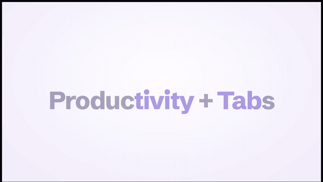

<picture>
  <source media="(prefers-color-scheme: dark)" srcset="src/assets/logo-wordmark-white.svg">
  
</picture>

**Tabtivity** — *A tab for each project. A tab for everything in it.*
(Formerly Eldrun; an existing install is carried over on its first start.)

# You open projects not applications

[](https://github.com/fseiffarth/tabtivity/actions/workflows/ci-cd.yml)
[](#license)
[](https://github.com/fseiffarth/tabtivity/releases)


[](screenshots/promo.mp4)

▶ **[Watch the 90-second promo with sound](screenshots/promo.mp4)** · made with Tabtivity, by an AI agent working in a Tabtivity tab

## Introduction

Tabtivity is a project-centric desktop layer that swaps your entire working context — windows, files, apps, Git state, layout, and especially AI agent terminals — as a single unit when you switch projects.

| **Who should try Tabtivity** | **Who should look elsewhere** |
| --- | --- |
| You work across several projects and want each one to bring back its own desktop, files, apps, and agent sessions. | Your main need is an autonomous agent platform that dispatches, supervises, and recovers multi-day work without your involvement. |
| You work on multiple remote machines or an HPC cluster over SSH and want easy reconnection and simple distribution of tasks across machines. | You want Tabtivity to manage the agent workflow. Tabtivity is a project workspace and control cockpit, not an autonomous agent scheduler. |
| You want to monitor or answer your agents from your phone or iPad independently of developer apps. | |
| You need structure and control and are tired of switching between your agent tabs. You use many different models (claude, openai, meta, google, ...) in parallel. | |

## Get started

1. **Install.** Grab a package from the
   [latest release](https://github.com/fseiffarth/tabtivity/releases/latest)
   (see [Download](#download)) or [build from source](#building-from-source).
   Nothing else is required; [optional tools](#optional-tools) unlock single
   features.
2. **Add a project.** Click **+** in the project bar. **New project** creates
   `~/tabtivity/projects/<name>/` with Git and agent docs (`AGENTS.md`,
   `CLAUDE.md`, `GEMINI.md`) already in place; **Import project** registers an
   existing folder in place, or copies or moves it.
3. **Start working.** Opening a project gives you a tab running your default
   agent. Set that command in **Settings**; any new tab can pick another
   installed agent CLI or a plain shell.
4. **Switch projects.** Click another project pill: its windows, tabs, files,
   and layout come back, and the previous project's desktop is parked until you
   return.
5. **Go further when you need it.** Point a project at an
   [SSH host or HPC cluster](docs/guide/features.md#remote-machines--hpc-clusters-the-second-differentiator),
   or opt a project into [Tabtivity Mobile](docs/guide/features.md#every-agent-from-your-phone-the-third-differentiator)
   (**Settings**, needs Tailscale) to answer your agents from your phone or iPad.

## Three pillars

**One project = one desktop.** Tabtivity is a project-centric desktop layer, not
just an app that launches or embeds other apps: projects own their windows and
desktop context, and selecting a project swaps that whole context — windows,
files, apps, Git state, and layout — as a single unit. The AI agent terminals,
file viewers, and app launcher ride on top, living *inside* a project once its
desktop is restored.

**One project = any machine.** A project is not tied to the computer in front of
you. Point it at an SSH host — or extend an existing local project onto one — and
its agent tabs, shells, Python runs, and jobs execute *there*, while the file
tree, viewers, and Git views keep working exactly as they do locally. No sshfs or
FUSE mount is involved, a project can span several machines at once, long runs
survive an SSH drop or a laptop lid, and SLURM clusters are driven from the same
cockpit. The goal is that *running a project on a cluster costs about as much
ceremony as running it locally*.

**Every agent = one phone or iPad.** An opt-in companion web app,
**Tabtivity Mobile**, reaches the same agent and shell tabs from a phone or an
iPad over your own private tailnet — read what an agent is doing and answer it
from another room, or mark up the PDF it built with the Apple Pencil and hand
the marks back. That is remote control for **every agent CLI Tabtivity runs** —
Claude, Codex, Gemini, Qwen, Grok, Cursor, Copilot, OpenCode and the rest —
whether or not its vendor ships a phone app for it, and without any vendor's
relay in between.

Built with **Tauri 2 + React + TypeScript** for Linux (X11 / KDE Wayland),
Windows, and macOS. Linux X11 is the reference platform; see
[Platforms and current limits](docs/guide/platforms.md) for the rest.

## Why Tabtivity

Are you also annoyed by switching between agent tabs or apps, keeping track of
which tab or agent works on which project? When you juggle several projects at
once, every project's windows — browsers, terminals, file managers, docs, agent
sessions — pile onto one desktop, and switching means digging for the handful
that belong where you're going.

Tabtivity flips the model. **Select a project, and the desktop becomes that
project:** its windows come forward, the previous project's windows park out of
the way, the default-app mappings re-route, and time tracking switches. Need two
projects at once? *Box* them — the box behaves like one project with a shared
desktop, file tree, and agent tabs — and unbox afterwards.

**How it compares.** Agent orchestrators (Vibe Kanban, Conductor, Claude Squad,
the Claude Code desktop app) manage agent processes *inside one repo* but have
no notion of your desktop. KDE Activities, virtual desktops, tmux, and `workon`
scripts each cover one slice without a project model. Remote tooling (VS Code
Remote, JupyterHub) attaches one editor to one host, leaving the cluster half a
terminal exercise. Vendor phone apps reach only *their own* agent through
*their own* relay. Tabtivity fills the gap between them — projects that own
their windows, the machines they run on, and one phone and iPad remote for
every agent — and runs alongside an orchestrator rather than replacing it.

## Highlights

- **[Project desktop](docs/guide/features.md#project-desktop-the-first-differentiator)**:
  window parking per project (X11, KDE Wayland, Windows, macOS), external
  window tracking, per-project default apps, and time tracking.
- **[Remote machines & HPC clusters](docs/guide/features.md#remote-machines--hpc-clusters-the-second-differentiator)**:
  a machine hub, projects that run on an SSH host without a mount, a local copy
  kept in step through Git, extra worker machines, tmux sessions that survive
  drops, and SLURM jobs from the UI.
- **[Every agent from your phone or iPad](docs/guide/features.md#every-agent-from-your-phone-the-third-differentiator)**:
  an Agents list of who is working, waiting or done, a chat view and touch
  terminal, files the agent sends you, read-only project files, and PDF markup
  with a finger or the Apple Pencil that goes straight back to the agent.
- **[Agents and terminals](docs/guide/features.md#agents-and-terminals)**:
  27 built-in agent CLIs plus your own and local Ollama models, per-tab
  session resume, scheduled prompts and chains, and a tiling, pop-out tab
  layout. Local agents run inside a default-on sandbox (the agent fence).
- **[Projects, boxes and isolation tiers](docs/guide/features.md#projects-and-boxes)**:
  boxes that join projects for a while, one-click publishing to GitHub or
  GitLab, and [container and VM projects](docs/guide/features.md#isolation-tiers-container-and-vm).
- **[Workspace apps](docs/guide/features.md#workspace-apps)**: mail with
  an encrypted local store and OpenPGP, a calendar with CalDAV, a to-do board,
  a reader-mode browser, a print manager, a deck presenter, and a private daily
  recap — several of them experimental and off by default.
- **[Files, viewers, and editing](docs/guide/features.md#files-viewers-and-editing)**:
  in-app viewers and editors for code, Markdown, YAML/JSON, BibTeX, LaTeX
  workspaces with SyncTeX, PDF (with real redaction), images, tables,
  notebooks, spreadsheets, SQLite, and more.
- **[Interface and learning](docs/guide/features.md#interface-and-learning)**:
  a theme customizer, a guided tour with ~30 lessons, and five languages.

The full tour is in **[docs/guide/features.md](docs/guide/features.md)**.

## Download

Prebuilt packages are published on the
[Releases page](https://github.com/fseiffarth/tabtivity/releases). From the
[latest release](https://github.com/fseiffarth/tabtivity/releases/latest),
grab the `.AppImage` (portable Linux) or `.deb` (Debian/Ubuntu), or the `.exe`
installer on Windows, or the unsigned universal Intel/Apple Silicon `.dmg`
on macOS. The CI release workflow publishes each platform whose packaging job
succeeds.

The macOS `.dmg` is neither signed nor notarized, so Gatekeeper refuses to open
the app as downloaded ("damaged" or "cannot be opened"). After dragging Tabtivity
into Applications, clear the download quarantine once:

```sh
xattr -dr com.apple.quarantine /Applications/Tabtivity.app
```

The Linux packages are built on Ubuntu 24.04, so they need glibc 2.39 or newer
(Ubuntu 24.04+, Debian 13+, Fedora 40+). On an older distro the loader fails
with `GLIBC_2.39 not found` — build from source there instead.

Once it is installed, **Settings → Updates** checks the same releases page from
inside the app and can download and install a newer build for you. It only
looks when you open that screen — Tabtivity never checks in the background — and
restarting is always yours to do. A copy installed from the `.deb` (or by any
other package manager) downloads the new build but leaves installing it to you.

### Optional tools

A release build needs nothing beyond the OS. Each of these unlocks one
feature, and every one of them is optional:

- Remote/SSH and HPC projects: nothing to install locally beyond OpenSSH — no
  `sshfs`, no FUSE. On the host: `tmux` for persistent sessions, plus
  `openvpn` locally for VPN-gated hosts
- Containerized projects: Docker. VM projects: QEMU/KVM
- Print manager: CUPS on Linux/macOS — nothing to install on Windows
- Tabtivity Mobile: Tailscale on this machine and on the phone or iPad
- Local model features — Vibe tabs, autocomplete, the mail
  assistant, the root console's agent tools (all off by default): Ollama

### Platform support

| Platform | Status | Notes |
| --- | --- | --- |
| **Linux — X11** | Yes | Reference platform; two-desktop window parking. |
| **Linux — KDE Wayland** | Yes | Per-project virtual desktops via KWin (KDE 5 and 6). |
| **Linux — other Wayland** | Partial | No workspace switching; terminals and files work. |
| **Windows** | Yes (alpha) | No agent fence and no tmux session persistence. |
| **macOS** | Yes (lightly tested) | Parks whole applications, not single windows. |
| **Phone / iPad** | Yes | Tabtivity Mobile, a web app over your own tailnet. |

Per-platform details and the current limits are in
[docs/guide/platforms.md](docs/guide/platforms.md).

## Building from source

Requirements: a Rust toolchain (`rustup`) and a current Node.js LTS release.
On Linux, also the Tauri system packages:

```bash
sudo apt install libwebkit2gtk-4.1-dev libssl-dev libgtk-3-dev \
    libayatana-appindicator3-dev librsvg2-dev
npm install
npm run tauri:dev
```

Windows needs nothing more (it uses the system WebView2); macOS needs the Xcode
command-line tools. Development builds, packaging, the stack, and where
Tabtivity keeps its state are in [docs/guide/building.md](docs/guide/building.md).

## Documentation

- [Features](docs/guide/features.md) — the full feature tour
- [Platforms and current limits](docs/guide/platforms.md)
- [Building, development and storage](docs/guide/building.md)
- [User help](docs/help/) — setup and troubleshooting per feature, also
  readable from inside the app
- [DOCUMENTATION.md](DOCUMENTATION.md) — architecture, data schemas, behavior
- [STATUS.md](STATUS.md) — what has been live-verified ·
  [ROADMAP.md](ROADMAP.md) — remaining work ·
  [VISION.md](docs/VISION.md) — the long-term strategy

## License

Tabtivity is dual-licensed under either of

- Apache License, Version 2.0 ([LICENSE-APACHE](LICENSE-APACHE) or
  <http://www.apache.org/licenses/LICENSE-2.0>)
- MIT license ([LICENSE-MIT](LICENSE-MIT) or
  <http://opensource.org/licenses/MIT>)

at your option.

Unless you explicitly state otherwise, any contribution intentionally submitted
for inclusion in the work by you, as defined in the Apache-2.0 license, shall be
dual-licensed as above, without any additional terms or conditions.
